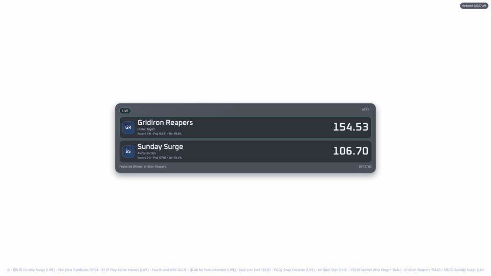

# Fantasy Football Overlay for OBS (Yahoo + ESPN + Sleeper)

A local, production-minded Node.js app that renders a real-time fantasy football broadcast overlay for OBS Browser Source.

Use it to show rotating weekly matchups, ticker mode, touchdown/lead-change alerts, provider-aware themes, and scene-specific overlay routes.

## Table of Contents

- [What You Get](#what-you-get)
- [Screenshots](#screenshots)
- [Project Structure](#project-structure)
- [Prerequisites](#prerequisites)
- [5-Minute Local Start (Mock Mode)](#5-minute-local-start-mock-mode)
- [Environment Variables (.env)](#environment-variables-env)
- [Configuration Precedence](#configuration-precedence)
- [First-Run Setup (Recommended Path)](#first-run-setup-recommended-path)
- [New-User Dry Run (Copy/Paste)](#new-user-dry-run-copypaste)
- [Provider Setup](#provider-setup)
- [Admin UI Guide (/admin)](#admin-ui-guide-admin)
- [Setup Center (/setup)](#setup-center-setup)
- [Overlay Modes and Scene Routes](#overlay-modes-and-scene-routes)
- [Show All Matchups vs One Team](#show-all-matchups-vs-one-team)
- [OBS Browser Source Setup](#obs-browser-source-setup)
- [Go-Live Checklist (Before Stream)](#go-live-checklist-before-stream)
- [Security Model](#security-model)
- [Data Persistence and Secret Storage](#data-persistence-and-secret-storage)
- [API and Route Reference](#api-and-route-reference)
- [Reliability and Polling Defaults](#reliability-and-polling-defaults)
- [Touchdown and Score Delta Behavior](#touchdown-and-score-delta-behavior)
- [Theme and Provider Branding](#theme-and-provider-branding)
- [Backup, Import, and Export](#backup-import-and-export)
- [Developer Commands](#developer-commands)
- [Docker (Optional)](#docker-optional)
- [Troubleshooting (No-Guesswork)](#troubleshooting-no-guesswork)
- [Repository Details and Metadata](#repository-details-and-metadata)
- [License](#license)

## What You Get

- Local-first app (`Express + vanilla HTML/CSS/JS`)
- Live overlay updates via `Server-Sent Events (SSE)` with frontend polling fallback
- High-frequency scoreboard + TD scan polling (default 10s / 10s)
- Providers: `Yahoo`, `ESPN`, `Sleeper`, plus `Mock` mode
- Admin control panel (`/admin`) for config + runtime controls
- Setup Center (`/setup`) for guided OBS scene setup with copy-ready URLs
- Setup Center readiness score with one-click fix links
- Per-scene routes (`/overlay/lower-third`, `/overlay/sidebar-widget`, etc.)
- Matchup scope modes:
  - Show all league matchups
  - Show only one focus team
- Reliability features:
  - Cache fallback
  - Circuit breaker + retries
  - Safe mode startup fallback
  - Schedule-aware polling
- Optional extras:
  - Audio event hooks
  - Per-event audio cooldown controls (TD/lead/upset/final)
  - Discord/Slack webhook notifications
  - OBS WebSocket scene switching
  - History export (JSON/CSV)
  - Replay window mode (last 15 minutes)
  - Panic fallback control (force mock mode)
  - Team logo cache warming
  - Local persistent event log in admin UI
  - Structured diagnostics zip bundle export

## Screenshots




## Project Structure

```text
.
├── cache/
├── client/
│   ├── admin.html / admin.css / admin.js
│   ├── overlay.html / overlay.css / overlay.js
│   └── setup.html / setup.css / setup.js
├── config/
│   ├── settings.json
│   └── settings.example.json
├── docs/
│   └── screenshots/
├── public/
│   ├── assets/
│   └── themes/
├── server/
│   ├── index.js
│   ├── dataService.js
│   ├── yahooAuth.js / yahooApi.js
│   ├── espnApi.js / sleeperApi.js
│   ├── normalizer.js
│   ├── configStore.js / tokenStore.js / secretStore.js
│   └── ...
├── test/
├── .env.example
├── Dockerfile
└── docker-compose.yml
```

## Prerequisites

- Node.js `18.17+` (Node `20.x` or `22.x` recommended)
- npm
- OBS Studio (latest stable recommended)
- Yahoo Developer app (only if using Yahoo provider)

Notes:
- `history.db` snapshot features use `node:sqlite` and work best on newer Node versions (Node `22` is safest).
- App still runs if SQLite history is unavailable.

## 5-Minute Local Start (Mock Mode)

This is the fastest way to confirm overlay + UI without auth.

1. Install dependencies:
```bash
npm install
```

2. Create env file:
```bash
cp .env.example .env
```

3. Keep mock mode enabled in `.env`:
```bash
MOCK_MODE=true
```

4. Start app:
```bash
npm run dev
```

5. Open:
- Admin: [http://localhost:3030/admin](http://localhost:3030/admin)
- Setup Center: [http://localhost:3030/setup](http://localhost:3030/setup)
- Overlay: [http://localhost:3030/overlay](http://localhost:3030/overlay)

If this works, your OBS/browser pipeline is good and you can switch to live provider data next.

## Environment Variables (`.env`)

Start from `.env.example`:

```bash
PORT=3030
APP_BASE_URL=http://localhost:3030

# Yahoo (optional if entered in /admin)
YAHOO_CLIENT_ID=
YAHOO_CLIENT_SECRET=
YAHOO_REDIRECT_URI=http://localhost:3030/auth/callback

# ESPN (optional defaults)
ESPN_LEAGUE_ID=
ESPN_SEASON=
ESPN_WEEK=current
ESPN_SWID=
ESPN_S2=

# Sleeper (optional defaults)
SLEEPER_LEAGUE_ID=
SLEEPER_SEASON=
SLEEPER_WEEK=current

# Startup mode
MOCK_MODE=true

# Optional route protections
ADMIN_API_KEY=
OVERLAY_API_KEY=

# macOS keychain support
USE_OS_KEYCHAIN=false
```

Important behavior:
- `ADMIN_API_KEY` protects admin/config routes.
- `OVERLAY_API_KEY` protects `/overlay`, `/events`, `/setup`, and public snapshot/config routes.
- If overlay key is set, pass `?overlayKey=YOUR_KEY` in OBS URLs (or `x-overlay-key` header).

## Configuration Precedence

When the app starts, settings are resolved in this order:

1. Built-in defaults (`server/defaultSettings.js`)
2. `config/settings.json`
3. Environment variables from `.env`
4. Runtime updates saved from `/admin`

Practical tip:
- If a value keeps reverting, check both `.env` and `/admin` for the same field.

## First-Run Setup (Recommended Path)

1. Start app with `npm run dev`.
2. Open `/admin`.
3. Set provider and league details.
4. Save settings.
5. Authorize provider if needed (Yahoo OAuth).
6. Run `Test API Connection`.
7. Open `/setup` and copy scene URLs.
8. Add those URLs in OBS Browser Sources.

## New-User Dry Run (Copy/Paste)

Use this section if you want near-zero ambiguity and a strict validation flow.

### 1) Shared Bootstrap (All Providers)

```bash
cd "/Users/tamem.jalallar/Library/CloudStorage/OneDrive-Ogilvy/Documents/App-Ideas/OBS/FantasyFootball-Yahoo"
cp .env.example .env
npm install
npm run dev
```

Expected result:
1. `http://localhost:3030/admin` loads.
2. `http://localhost:3030/setup` loads.
3. `http://localhost:3030/overlay` loads.
4. `http://localhost:3030/health` returns JSON with `"ok": true`.

### 2) Mock Provider Dry Run (No Auth)

Paste this into `.env`:

```bash
PORT=3030
APP_BASE_URL=http://localhost:3030
MOCK_MODE=true
ADMIN_API_KEY=
OVERLAY_API_KEY=
USE_OS_KEYCHAIN=false
```

Then:
1. Restart app (`npm run dev`).
2. In `/admin`, set Provider to `Mock` and click `Save Settings`.
3. Click `Test API Connection`.
4. Open `/overlay/centered-card`.

Expected result:
1. Test API returns success.
2. Overlay rotates matchup cards.
3. `/setup` checklist shows data is loaded.

### 3) Yahoo Dry Run (OAuth)

Paste this into `.env` (replace placeholders):

```bash
PORT=3030
APP_BASE_URL=http://localhost:3030
YAHOO_CLIENT_ID=YOUR_YAHOO_CLIENT_ID
YAHOO_CLIENT_SECRET=YOUR_YAHOO_CLIENT_SECRET
YAHOO_REDIRECT_URI=http://localhost:3030/auth/callback
MOCK_MODE=false
ADMIN_API_KEY=
OVERLAY_API_KEY=
USE_OS_KEYCHAIN=false
```

Then:
1. Restart app.
2. In `/admin`, set Provider to `Yahoo`.
3. Enter `League ID`, `Game Key` (or `Season`), and `Week`.
4. Click `Save Settings`.
5. Click `Start Yahoo OAuth` and complete consent.
6. Back in `/admin`, click `Test API Connection`.
7. Open `/setup` and confirm checklist passes.
8. Open `/overlay/lower-third` and verify live data.

Expected result:
1. OAuth status shows authorized.
2. Test API returns success.
3. Overlay displays real Yahoo matchup values.

Private League Quick Fixes (Yahoo):
1. Redirect mismatch: in Yahoo developer app and `/admin`, use exactly `http://localhost:3030/auth/callback`.
2. Wrong account during auth: log out of Yahoo in browser, then run `Start Yahoo OAuth` again.
3. Stale token state: click `Clear Stored Tokens`, save settings, then restart OAuth.
4. League visibility issue: verify the authenticated Yahoo account is actually a manager/member of the target `League ID`.
5. Game key mismatch: use the season’s correct `Game Key` (for example, 2025 vs 2026) and re-test.

### 4) ESPN Dry Run

Paste this into `.env` (replace placeholders):

```bash
PORT=3030
APP_BASE_URL=http://localhost:3030
ESPN_LEAGUE_ID=YOUR_ESPN_LEAGUE_ID
ESPN_SEASON=2026
ESPN_WEEK=current
ESPN_SWID=
ESPN_S2=
MOCK_MODE=false
ADMIN_API_KEY=
OVERLAY_API_KEY=
USE_OS_KEYCHAIN=false
```

Then:
1. Restart app.
2. In `/admin`, set Provider to `ESPN`.
3. Confirm league/season/week values.
4. For private leagues, add `SWID` and `espn_s2`.
5. Click `Save Settings`.
6. Click `Test API Connection`.
7. Open `/overlay/sidebar-widget`.

Expected result:
1. Test API returns success.
2. Overlay renders ESPN-normalized matchup cards.

Private League Quick Fixes (ESPN):
1. Private league auth: fill both `ESPN SWID` and `ESPN S2` in `/admin`, then save.
2. Cookie formatting: keep SWID with braces if ESPN gives braces (example `{XXXXXXXX-XXXX-XXXX-XXXX-XXXXXXXXXXXX}`).
3. Stale browser cookies: re-copy `SWID` and `espn_s2` from a fresh logged-in ESPN web session.
4. Wrong season/week: confirm `ESPN Season` and `ESPN Week` match active matchup data.
5. Access mismatch: confirm the ESPN account tied to those cookies has access to the target league.

Tiny Screenshot Callout: Where to find `SWID` and `espn_s2`


Quick reminder:
1. Open your ESPN league in browser.
2. Open DevTools -> Application/Storage -> Cookies -> `https://fantasy.espn.com`.
3. Copy `SWID` and `espn_s2` values into `/admin`.

### 5) Sleeper Dry Run

Paste this into `.env` (replace placeholders):

```bash
PORT=3030
APP_BASE_URL=http://localhost:3030
SLEEPER_LEAGUE_ID=YOUR_SLEEPER_LEAGUE_ID
SLEEPER_SEASON=2026
SLEEPER_WEEK=current
MOCK_MODE=false
ADMIN_API_KEY=
OVERLAY_API_KEY=
USE_OS_KEYCHAIN=false
```

Then:
1. Restart app.
2. In `/admin`, set Provider to `Sleeper`.
3. Confirm league/season/week values.
4. Click `Save Settings`.
5. Click `Test API Connection`.
6. Open `/overlay/ticker`.

Expected result:
1. Test API returns success.
2. Ticker and matchup cards render Sleeper-normalized values.

### 6) Final Validation Before OBS

1. In `/setup`, verify checklist passes for provider/auth/league/data.
2. Copy scene URLs from Scene Presets.
3. Add URLs to OBS Browser Sources.
4. Confirm the overlay updates at least once without page refresh.

## Provider Setup

### Yahoo Setup (OAuth)

Yahoo requires OAuth before live data is available.

1. Create a Yahoo developer app.
2. Add callback URL exactly as:
   - `http://localhost:3030/auth/callback`
3. In `/admin` -> Yahoo OAuth section, fill:
   - `Client ID`
   - `Client Secret`
   - `Redirect URI`
   - `Scope` (default `fspt-r`)
4. Save settings.
5. Click `Start Yahoo OAuth`.
6. Complete authorization in browser.
7. Return to `/admin` and run `Test API Connection`.

You also need league targeting set:
- `League ID`
- `Game Key` (preferred) or `Season`
- `Week` (`current` or custom week)

### ESPN Setup

1. In `/admin` set Provider = `ESPN`.
2. Enter:
   - `ESPN League ID`
   - `ESPN Season`
   - `ESPN week` (`current` or custom)
3. For private leagues, also provide:
   - `SWID`
   - `espn_s2`
4. Save and run `Test API Connection`.

### Sleeper Setup

1. In `/admin` set Provider = `Sleeper`.
2. Enter:
   - `Sleeper League ID`
   - `Sleeper Season`
   - `Sleeper week` (`current` or custom)
3. Save and run `Test API Connection`.

### Mock Setup

1. Set Provider = `Mock` or keep `MOCK_MODE=true`.
2. Optionally set a `Mock Seed` for deterministic previews.
3. Save and preview overlays.

## Admin UI Guide (`/admin`)

Main panels you will use most:

- `Admin Access`:
  - Optional admin key + overlay read key
  - Reduced motion toggle
  - OS keychain toggle
- `Yahoo OAuth`:
  - Start auth
  - Clear stored tokens
- `League & Polling`:
  - Provider selection
  - League/week targeting
  - High-frequency polling (`scoreboardPollMs`, `tdScanIntervalMs`)
  - Adaptive/schedule-aware polling
  - Safe mode + circuit breaker + rate budget
- `Overlay Behavior`:
  - Carousel vs ticker
  - Scene preset
  - Matchup scope: all league or one focus team
  - Theme mode (auto/manual/off)
  - Story cards, auto-redzone, deltas, highlights
- `Theme`:
  - Colors, background, font scale
  - Provider override behavior
- `Branding & Integrations`:
  - League title/watermark
  - Discord/Slack webhooks
- `Audio Queue`:
  - Event templates and per-event cooldown controls
- `OBS Automation`:
  - OBS WebSocket config + scene mappings
- `Diagnostics`:
  - API latency, error counts, circuit state, SSE clients, next poll times
  - Export history JSON/CSV
  - Replay last-15-minutes mode
  - Download structured diagnostics zip
- `Event Log`:
  - Local persisted event timeline (polling, auth, controls, fallback, replay)
- `OBS Links / Scene Setup Map / Setup Checklist`:
  - Copy-ready URLs and labels for stream operators
  - Export/import OBS scene JSON
  - Panic fallback and logo cache warm buttons

## Setup Center (`/setup`)

Use this as the operator-facing page for getting OBS ready.

It includes:
- Setup checklist (provider/auth/league/data/sync/overlay URL)
- Readiness score (percentage + one-click fix links)
- Scene preset cards with:
  - Label
  - Use case
  - Placement
  - Recommended size
  - Copy URL / Copy Label buttons
- Provider theme quick preview links
- Repo details:
  - version
  - branch
  - commit
  - last commit timestamp + subject
  - dirty/clean working tree

It can export `obs-scene-setup-guide.md` directly.

## Overlay Modes and Scene Routes

Base route:
- `/overlay`

Preset routes (best for OBS scene naming):
- `/overlay/centered-card`
- `/overlay/lower-third`
- `/overlay/sidebar-widget`
- `/overlay/bottom-ticker`
- `/overlay/ticker`

Useful query params:
- `preset=centered-card|lower-third|sidebar-widget|bottom-ticker`
- `mode=carousel|ticker`
- `twoUp=1`
- `scale=0.90`
- `scope=league|team`
- `team=<team_key_or_name>`
- `providerTheme=auto|off|yahoo|espn|sleeper|mock`
- `overlayKey=<OVERLAY_API_KEY>` (if enabled)

Examples:
- `http://localhost:3030/overlay/lower-third?scale=0.95`
- `http://localhost:3030/overlay/centered-card?scope=team&team=449.l.12345.t.1`
- `http://localhost:3030/overlay/ticker?providerTheme=espn`
- `http://localhost:3030/overlay/sidebar-widget?overlayKey=YOUR_KEY`

## Show All Matchups vs One Team

Option A: All league matchups
1. In `/admin` set `Matchup Scope = All League Matchups`.
2. Save.

Option B: One team only
1. In `/admin` set `Matchup Scope = Only One Team`.
2. Set `Focus Team` (team key or exact team name).
3. Save.

Equivalent URL override:
- `?scope=team&team=<team_key_or_name>`

## OBS Browser Source Setup

For each scene in OBS:

1. Add `Browser Source`.
2. URL = one of your overlay preset URLs.
3. Width/height guidance:
   - centered-card: `1920x1080`
   - lower-third: `1920x420`
   - sidebar-widget: `640x1080`
   - bottom-ticker: `1920x220`
   - ticker: `1920x140`
4. Enable transparent background in scene composition.
5. If overlay key is enabled, include `?overlayKey=...` in URL.
6. Optional OBS Browser Source flags:
   - `Shutdown source when not visible`
   - `Refresh browser when scene becomes active`

Pro tip:
- Use `/setup` Scene Preset labels directly as OBS scene names.

## Go-Live Checklist (Before Stream)

1. `/admin` shows successful `Test API Connection`.
2. `/setup` checklist shows Provider/Auth/League/Data all passing.
3. OBS Browser Source URLs include `overlayKey` if required.
4. At least one overlay preset is visible and updating in OBS preview.
5. Polling intervals are confirmed for game window (`scoreboardPollMs` and `tdScanIntervalMs`).
6. Optional integrations (audio, Discord/Slack, OBS WebSocket) are tested once manually.

## Security Model

- Admin API routes require key only if `ADMIN_API_KEY` or `security.adminApiKey` is set.
- Overlay/read routes require key only if `security.overlayApiKey` is set.

Header/query auth support:
- Admin:
  - Header: `x-admin-key`
  - Query fallback: `?adminKey=...`
- Overlay/read:
  - Header: `x-overlay-key`
  - Query fallback: `?overlayKey=...`

## Data Persistence and Secret Storage

- Main settings: `config/settings.json`
- OAuth tokens: `config/tokens.json` (or macOS Keychain)
- Secrets: `config/secrets.json` (or macOS Keychain)
- History DB: `cache/history.db` (when SQLite available)

Security detail:
- `config/settings.json` intentionally persists secret fields as blank values.
- Secrets are resolved from `config/secrets.json` or Keychain at runtime.

## API and Route Reference

Public (no admin key required):
- `GET /health`
- `GET /metrics`
- `GET /api/repo-details`
- `GET /admin`

Overlay-read protected only when overlay key is configured:
- `GET /setup`
- `GET /overlay`
- `GET /overlay/centered-card`
- `GET /overlay/lower-third`
- `GET /overlay/sidebar-widget`
- `GET /overlay/bottom-ticker`
- `GET /overlay/ticker`
- `GET /events`
- `GET /api/public-config`
- `GET /api/public-snapshot`

Admin-protected (when admin key configured):
- `GET /api/config`
- `PUT /api/config`
- `GET /api/config/export`
- `POST /api/config/import`
- `GET /api/status`
- `GET /api/diagnostics`
- `GET /api/diagnostics/bundle`
- `GET /api/history`
- `GET /api/history/export?format=json|csv&hours=168`
- `POST /api/history/replay`
- `POST /api/history/replay/window/start`
- `POST /api/history/replay/window/stop`
- `GET /api/data`
- `POST /api/refresh`
- `POST /api/test-connection`
- `POST /api/validate-config`
- `POST /api/control/next`
- `POST /api/control/pause`
- `POST /api/control/resume`
- `POST /api/control/pin`
- `POST /api/control/unpin`
- `POST /api/control/story`
- `POST /api/control/warm-logos`
- `POST /api/control/panic-fallback`
- `GET /api/obs/scenes/export`
- `POST /api/obs/scenes/import`
- `GET /api/events/log`
- `DELETE /api/events/log`
- `POST /api/auth/logout`
- `GET /api/profiles`
- `POST /api/profiles/save`
- `POST /api/profiles/switch`
- `DELETE /api/profiles/:profileId`
- `GET /auth/start`

## Reliability and Polling Defaults

Default high-frequency behavior:
- Scoreboard poll: `10000ms`
- TD scan: `10000ms`

Guardrails:
- Minimum poll interval clamp is `5000ms`.
- Adaptive polling can run slower when slate is less active.
- Schedule-aware mode slows polling during off-hours.
- Circuit breaker opens after repeated failures and cools down.
- Safe mode can force startup fallback to cache/mock when auth is down.

## Touchdown and Score Delta Behavior

- TD scanner runs separately from scoreboard polling.
- Player-level scoring deltas are tracked and emitted as alert events.
- Dedup window prevents duplicate TD spam (`tdDedupWindowMs`).
- Overlay highlights score changes without full page refresh/flicker.

## Theme and Provider Branding

Theme modes:
- `auto`: use provider from current data source
- `manual`: force provider theme (`yahoo`, `espn`, `sleeper`, `mock`)
- `off`: use custom theme only

Theme packs available:
- `neon-grid`
- `classic-gold`
- `ice-night`

You can also:
- enable provider badge
- apply provider defaults in admin
- override colors/fonts per profile
- use visual profile save/apply for quick switching

## Backup, Import, and Export

- Export config: `GET /api/config/export` from admin UI button
- Import config: `POST /api/config/import` from admin UI button
- Export timeline: JSON/CSV from diagnostics panel

Recommended routine:
1. Export config before big changes.
2. Save named profiles for each league/provider.
3. Keep `config/settings.json` under version control if desired.
4. Keep secrets out of git (`.env`, `config/secrets.json`, tokens).

## Developer Commands

Run app:
```bash
npm run dev
```

Run tests:
```bash
npm test
```

Syntax check:
```bash
npm run check:syntax
```

Optional UI smoke test:
```bash
npm run test:smoke
```

## Docker (Optional)

Build and run with compose:
```bash
docker compose up --build
```

Then open:
- [http://localhost:3030/admin](http://localhost:3030/admin)
- [http://localhost:3030/overlay](http://localhost:3030/overlay)

## Troubleshooting (No-Guesswork)

### 401 Unauthorized on `/admin` API

Cause:
- Admin key is enabled but not provided.

Fix:
1. Enter key in Admin Access section.
2. Or send header `x-admin-key`.
3. Or use query `?adminKey=...` when launching OAuth start route.

### 401 Unauthorized on `/overlay` or `/setup`

Cause:
- Overlay read key is enabled.

Fix:
1. Append `?overlayKey=YOUR_KEY` to overlay/setup URLs.
2. For custom clients, send `x-overlay-key` header.

### Yahoo OAuth callback failure

Cause:
- Redirect URI mismatch.

Fix:
1. Ensure Yahoo app callback exactly equals `http://localhost:3030/auth/callback`.
2. Ensure same value in `/admin` redirect URI.
3. Clear stored tokens and re-run OAuth.

### Test API connection fails

Cause:
- Provider credentials/league/week mismatch or private league cookies missing.

Fix:
1. Confirm provider selection.
2. Confirm league ID and season/week values.
3. For ESPN private leagues, set SWID + espn_s2.
4. Use Mock mode to verify overlay rendering path.

### Overlay loads but does not update

Cause:
- SSE interrupted or key mismatch.

Fix:
1. Check `/health` and `/metrics`.
2. Verify `/events` is reachable with same overlay key.
3. Confirm browser source URL includes `overlayKey` if enabled.
4. Check diagnostics for circuit breaker/fallback state.

### TD alerts are not appearing

Cause:
- Alerts disabled, dedup suppression, or provider payload limitations.

Fix:
1. Enable `Show TD Alerts`.
2. Lower dedup window for testing.
3. Verify active lineup data is available.
4. Confirm provider polling is successful in diagnostics.

### History export is empty

Cause:
- SQLite history unavailable or history disabled.

Fix:
1. Enable history in admin.
2. Use Node version with `node:sqlite` support.
3. Confirm `cache/history.db` is being created.

## Repository Details and Metadata

The app exposes repo metadata for the Setup Center:
- `GET /api/repo-details`

Source fields include:
- package name/version
- repository URL
- git branch
- full + short commit SHA
- last commit timestamp and subject
- working tree clean/dirty status
- active Node runtime version

Repository URL:
- [TamemJalallar/FantasyFootball-Yahoo](https://github.com/TamemJalallar/FantasyFootball-Yahoo)

## License

MIT
